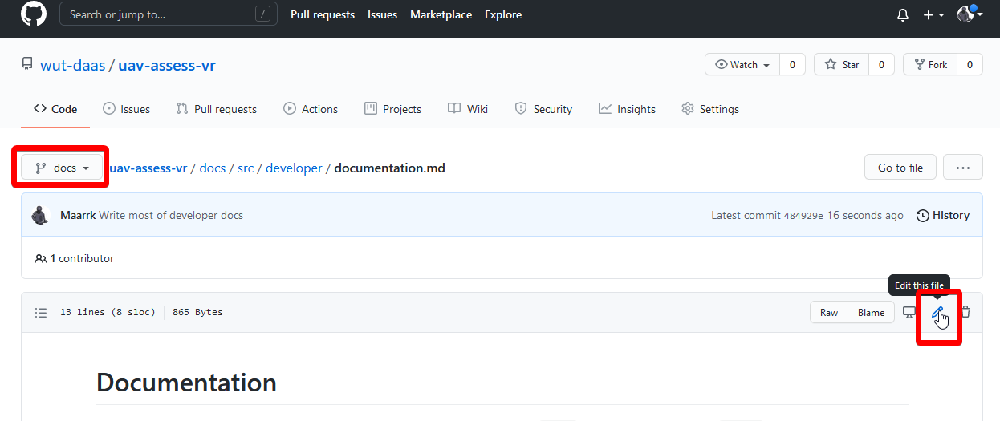

# Documentation

This documentation is built from Markdown files using [Vuepress](https://vuepress.vuejs.org). Anytime the `docs/` directory is updated on `master` branch of the repository, the HTML sites are built by [Github Actions](https://github.com/features/actions), and published to [Github Pages](https://pages.github.com/) at the [https://wut-daas.github.io/uav-assess-vr/](https://wut-daas.github.io/uav-assess-vr/) URL.

## Contributing

::: warning
TODO: Currently `Edit this page` link is not working, getting a 404 from Github. Set `editLinks` to `true` in `config.js` once the problem is fixed to show the links back again.
:::

**Please make your edits and pull requests against `docs` branch, a maintainer will rebase and fast forward `master` after reviewing and aggregating the changes.**

To do basic text edits, you can simply find the source files in the Github repository and edit them in browser. Markdown syntax is human-readable, and rather simple to learn.



If you are wondering how to insert images, code blocks, tips or any other feature, browse to the source of the page you've seen those in. Because Github also renders Markdown elements, click `Raw` button (next to edit icon), to see the source file. In case you want to use a feature that was not used anywhere in the docs, consult [Vuepress Markdown reference](https://v1.vuepress.vuejs.org/guide/markdown.html)

## Advanced editing

If you are planning on doing more advanced edits, like adding pages, images or changing the style of the documentation, it is advised to run a local server to test the changes before pushing them to the repository.

### Prerequisites

- [Node JS](https://nodejs.org/en/) - environment to run server-side JavaScript code
- _(strongly recommended)_ [VS Code](https://code.visualstudio.com/) - text editor with rich Markdown and JavaScript editing

Once you checked out the repository, open the folder in VS code. Open the integrated terminal with Ctrl+` (grave accent above Tab key), and install required node packages:

```
cd docs
npm install
```

### Running the server

With the `docs` directory open in the terminal, start the local server:

```
npm run dev
```

If everything went well, you should see something like `success [14:32:07] Build dba131 finished in 7183 ms! VuePress dev server listening at http://localhost:8081/uav-assess-vr/`. Usually, you can left-click the link while holding down the Ctrl key to open the address in your default browser.

**To stop the server, focus the terminal and press Ctrl+C.** You may need to confirm to `Terminate batch job`, press Y and then Enter.

### Editing

While the server is running, when a source file is saved the page is automatically updated. New images can also be added to the directory and referenced in markdown this way. If you don't see the changes because you just restarted the server and left the page open, refresh the page in browser and it should work again.

**After adding new pages, remember to include them in a relevant sidebar `children` array in [`.vuepress/config.js`](https://github.com/wut-daas/uav-assess-vr/blob/master/docs/src/.vuepress/config.js)**

::: warning
You need to restart the server to see any changes outside the main article content, e.g. sidebar, theme, new pages, etc.
:::

::: tip
You can reformat the whole document using Shift+Alt+F in VS Code, please do that before committing your files
:::
