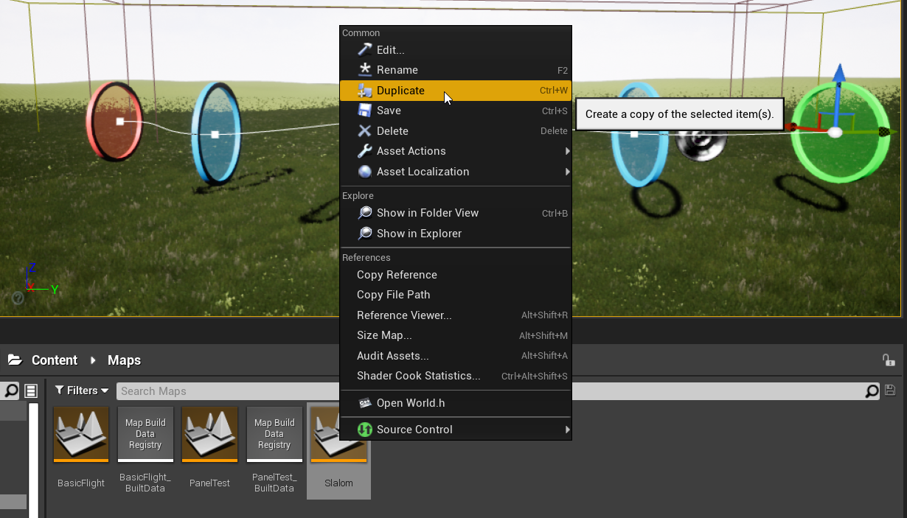
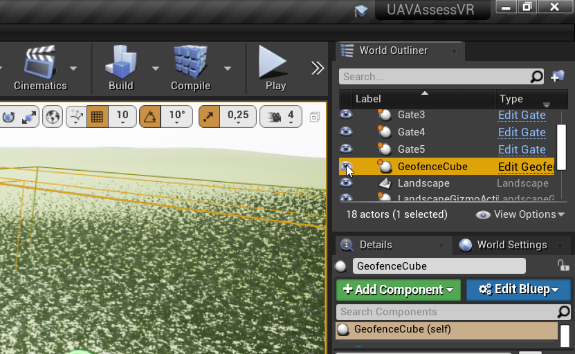

# Operator tasks (levels)

Every track or task to be performed by the UAV operator should be made into a separate UE4 level. Place the levels in `Content/Maps`. The name of the file as it appears in the Content Browser will also be sent to the assessment function and saved in logs, so make it descriptive.

::: tip
Instead of creating a new level from scratch it is often easier to select an existing one in the Content Browser, and select `Duplicate (Ctrl+W)` from the context menu. Then name and modify your copy as needed.
:::

## Level elements

Actor classes that are a part of the level are placed in `Content/Blueprints/Level`.

::: warning
UE4 uses "Unreal Units" which correspond directly to centimeters (cm). They are converted into meters for logs and assessment.
:::

### Reference track

This is the perfect trajectory for the UAV to follow, and be evaluated against. The main part of the track is the `SplineComponent` that controls the trajectory. The spline itself is invisible during gameplay, but arrows can be placed along its length according to `Place Meshes` checkbox.

To modify the spline, select any of its control points (drawn as white squares), and move it with the usual UE4 controls. When a control point is selected, its tangent line should be visible, which can also be manipulated by its ends. Control points can also be rotated, the rotation along spline will affect placed arrows. **To add a new point its easiest to move an existing one while holding the Alt key**.

To save the track details, select component `TrackSplineExporter` in details panel, and use the GUI in the `Track Export` section. The files will be saved to `UAVAssessVR/Saved/LevelDefinitions`

### Gates

In order to complete the task, the UAV needs to fly through any green start gate, all the blue checkpoint gates (but there can be none of these), and a red finish gate.

To help with aligning the gates to the track, there is a `Snap to Track` button in the details panel, which will move and align them with the closest point of the reference track. The start and finish gates can also be created aligned to the reference track using buttons `Add Start` and `Add Finish` in details panel of `ReferenceTrack`.

### Geofence

To contain the UAV in a designated space, a `GeofenceCube` actor can be placed. It displays a red grid whenever the UAV is closer than `Proximity Radius` (in cm) from one of its planes. In case of collision, a `DroneGeofenceBreach` event will be called in the game mode blueprint.

::: tip
When the viewport camera is outside the `GeofenceCube`, clicking on objects inside the geofence will select the transparent geofence instead. You can prevent this by hiding this object in the editor, using the eye icon in the World Outliner. It will be visible during gameplay regardless.
:::

## Operator

The operator location and initial orientation is defined using the `PlayerStart` object. The correct character (`OperatorCharacter`) will be spawned when gameplay starts, based on the setting in `Class Defaults` of `FlightGameMode` class.

## Drone

The UAV movement is controlled by the `SwitchableDrone` actor. By default, it spawns the crude cuboid-cone 3D model. To select a different 3D model, first drag the desired model from `Content/Blueprints/Drones` anywhere into the level. Then, in details panel of `SwitchableDrone` set `Drone Actor` field to the model you just placed in the level, e.g. using the dropper icon.
