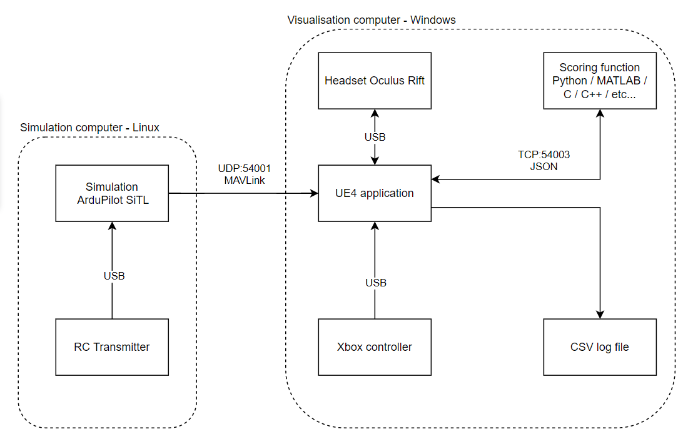

# Introduction

UAV Assess Vr is a system for evaluating unmanned aerial vehicle performance in simulated environment. The system is separated into a few applications, communicating via IP or files.

## Features

- Displaying a real-time UAV in Unreal Engine, with VR support
- Real-time evaluation of performance in another process communicating over TCP
- Common logging format for simulation and evaluation results
- Real-time performance feedback to the operator
- Easy creation of new scenarios using built-in UE4 level editor
