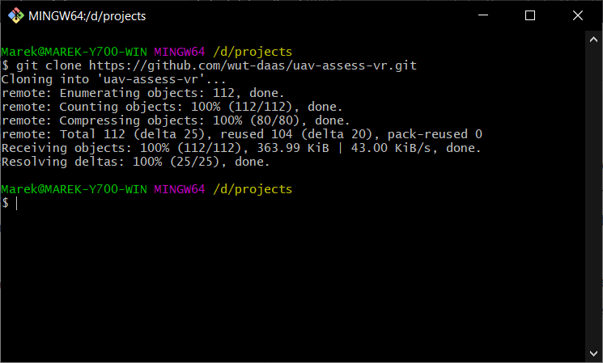
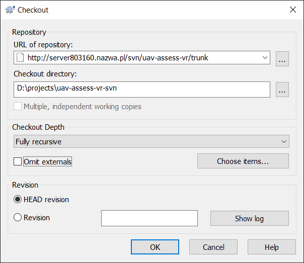
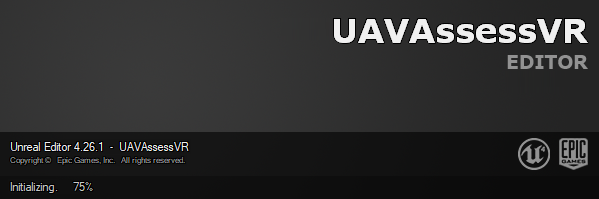
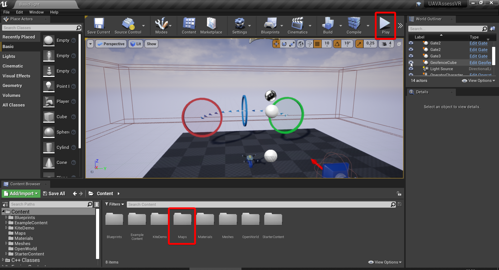
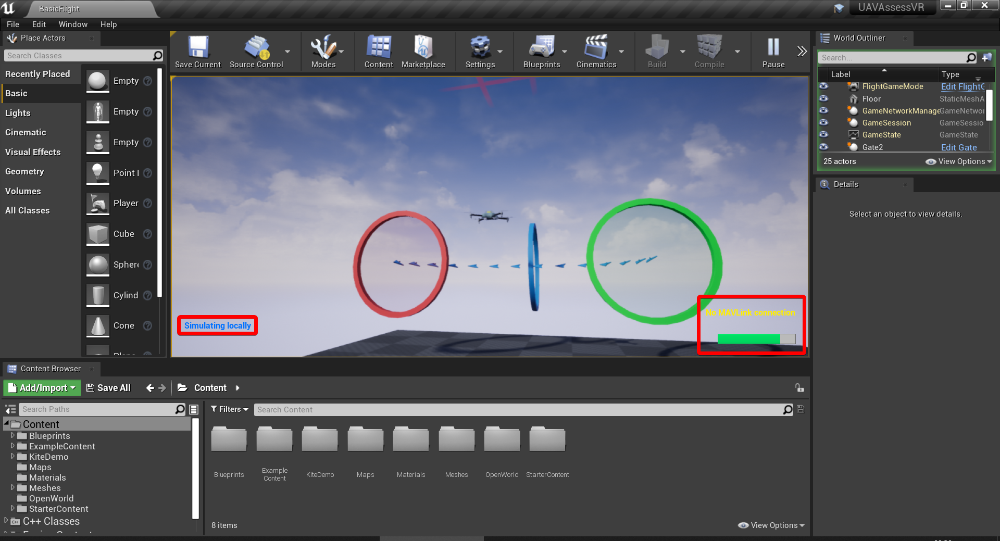
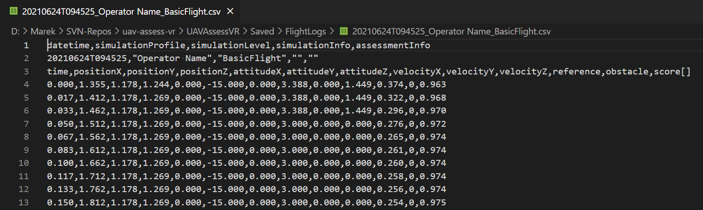

# Getting started

## Prerequisites

The minimal setup consists of:

- [Unreal Engine 4](https://unrealengine.com/), the project was made with version 4.26.1
- A Subversion client, for Windows [TortoiseSVN](https://tortoisesvn.net/) is recommended
- A Git client, either [the original](https://git-scm.com/), or one of many GUI alternatives
- [Python 3](https://python.org/) and/or [MATLAB](https://mathworks.com/) 2021a and newer

::: tip
The following instructions assume you are using Windows with Git and SVN clients recommended above and Python 3. All of them installed with default settings as of writing this guide. Otherwise consult appropriate manuals.
:::

## Downloading the applications

Navigate to the folder where you want to store the project, open context menu (right click) and select `Git Bash Here`. Type the following command and confirm with Enter (Shift+Insert can be used to paste).

```sh
git clone https://github.com/wut-daas/uav-assess-vr.git
```

Wait until the next command prompt appears (a `$` followed by blinking cursor) and close this window.



Once again open context menu in the folder you wish to store the project, but this time select `SVN Checkout...`. Paste the following URL into `URL of Repository` field. Before you click `OK`, you might want to change the value of the `Checkout directory:` to prevent a conflict with the git folder

```
http://server803160.nazwa.pl/svn/uav-assess-vr/trunk
```



## Running a test

Navigate to the directory where you checked out the SVN repository, then `UAVAssessVR` subdirectory. Open `UAVAssessVR.uproject` file located there. Please note that it may take a while before Unreal Engine shows the loading window.



Navigate to the directory where you cloned the Git repository, then `external-assessment` subdirectory. Holding Shift, right click and select `Open PowerShell here`. Type the following command and confirm with Enter (Ctrl+V or Shift+Insert can be used to paste). Keep this process running during whenever you want to get live assessment.

```
python assessment-server.py
```

---

Once the Unreal project is loaded, using `Content Browser` in the bottom section of the screen, open folder `Maps` and then open level `BasicFlight`. Click the `Play` button in the top bar, and then click inside the viewport.



Press C key, a `Simulating locally` indicator should appear in the bottom left corner of the screen. With that it is now possible to control the UAV with WASD and arrow keys. Ignore the `No MAVLink connection` indicator.

Fly through the start gate (green). A progress bar should appear that gets filled less as the UAV moves away from the series of blue arrows, and grow when the distance between UAV and the trail gets smaller. Fly the UAV through all checkpoint gates (blue) and the finish gate (red). A `Saving...` indicator should briefly appear when you are finishing the run.



## Getting the results

Navigate to the Unreal project directory (where the `UAVAssessVR.uproject` file is located), then into `Saved` and `FlightLogs` subdirectories. Data is saved to `.csv` files with fields separated with comma (`,`), decimal place is period (`.`) and text strings except datetime are encased with double quotes (`"`). The filenames follow this format:

```
{date YYYYMMDD}T{hour HHMMSS}_{operator name}_{level name}.csv
```

The units used are seconds, meters, meters per second and degrees. Depending on the assessment function used during the attempt, there may be multiple columns with score. The first score should always be overall operator performance between 0 and 1 - this is the value displayed during the simulation using operator performance indicator.


